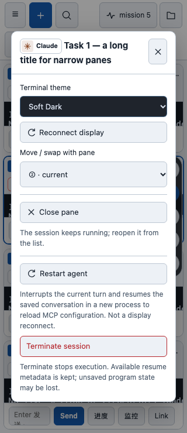

# 当前 Agent 会话重启

日期：2026-09-28。

## 使用入口与边界

在对应 pane 的「更多 → 重启当前 Agent」确认操作。英文为 **Restart agent**。

这不是「重连显示」：后者只重新连接终端视图；新操作正常退出选中的 Agent，再以同一个已保存的原生对话 ID 启动新进程。SiLing 会生成新的 run/tmux session，并替换对应 pane；其他 pane 不重新连接。

适用于 Claude、Codex、Cursor。纯 Terminal 不提供此入口。远程操作转发到原节点，因此远端也需要更新到支持该接口的版本。

新进程可以重新读取 Agent 的 MCP 配置，但本功能不下载更新，也不重启独立部署的 MCP 服务。CLI 启动成功不代表每个 MCP 服务已经健康连接，需在 Agent 内确认。

## 为什么需要单独实现

原有「重连显示」只销毁并重新挂载当前 pane 的 iframe/数据源；现有恢复操作又只面向已经退出的 Agent。直接拼接停止和新建会丢失原生会话身份，失败后也可能误启动空白会话。

新接口 `POST /api/sessions/{run_id}/restart` 复用原有正常退出与原生恢复逻辑，并增加以下约束：

- 先检查运行状态、支持的 Agent、已保存的恢复 ID、工作目录及元数据能否保存，再中断 Agent。不按相同目录猜测其他对话的 ID。
- 正常退出等待最多约 12 秒；失败不升级为强杀。确认退出后才清理旧 tmux 包装会话。
- 同一个 run 的并发重启返回冲突；客户端不自动重试结果不明的请求。
- 保留名称、模型／effort、终端配色、人工标记及关联文件，沿用现有恢复及复制逻辑。
- 重启期间禁用当前 pane 的交互；成功后恢复下方输入框草稿。若 pane 被移动，跟随其当前位置，不覆盖原槽位的新内容。
- 启动失败或响应丢失时显示恢复建议，保留原 pane 和草稿供检查；已停止的原会话可以从现有 Resume 流程恢复。
- 收紧退出标记为整行匹配，避免说明文字中提到退出标记就被当成已退出。

## 修改文件

- `agent_orchestrator/dashboard.py`：重启接口、并发保护、复用恢复函数、远程返回 ID 与超时处理。
- `static/index.html`：菜单、确认、进行中保护、槽位与草稿处理。
- `static/ui-foundation.js`、`static/ui-foundation.css`：中英文文案与进行中提示。
- `tests/test_agent_restart.py`：11 项后端测试。
- `tests/ui_browser.mjs`：确认取消、失败、重复点击、轮询保留、移动竞态、草稿及 iframe 回归。
- `README.md`、`README_CN.md`、本报告和截图：使用说明、风险与验证范围。

## 验证与限制

- 整合自有 main 的最新终端复制修复后，完整 unittest：**252/252 通过**，Python 3.13.5，warnings-as-errors，无跳过。
- Python 编译、逐文件 shell 语法、示例 JSON、inline JS／模块／浏览器脚本语法及 diff 空白检查通过。
- Edge 隔离页面测试通过，含 1280、1440、768、390、320px 视口。重启只多加载一个新 iframe；其他面板与草稿保留。
- 真实 tmux/ttyd 的跨屏拖选／滚轮复制及终端链接回归，以及独立 Terminal 的后台创建 → 接入 → 发送并读取结果 → 停止冒烟通过。没有停止用户现有会话。
- 原生 Agent 的退出和启动在接口测试中使用替身，验证了三类 Agent 的原生恢复参数、错误路径及远程转发。**没有实际重启用户 Agent 或做真实 MCP 更新的端到端验证**；桌面模拟手机尺寸也不等于 iOS 真机验收。

## 退出确认时序修复（2026-09-28）

用户实际操作出现 `waiting for agent exit`。根因是原有正常退出函数把第二次 Ctrl+C 的间隔绑定到总超时：默认约 4.2 秒，错过 CLI 的短时退出确认窗口。之前接口测试替换了正常退出函数，因此没有覆盖这个真实时序。

本次只修复该时序：第一次发送后，在约 350ms 的首次轮询检查退出状态；尚未退出才发送第二次。剩余超时用于正常退出和保存记录，计时改用单调时钟。最多两次按键，失败仍不强杀、不启动替代会话。该函数也被普通停止流程复用。

修改文件为 `agent_orchestrator/dashboard.py`、`tests/test_agent_restart.py`、新增 `tests/fixtures/exit_confirmation.py` 及本报告。

- 新增 5 项测试：短间隔与总超时解耦、首次按键即退出、无响应时限、发送失败，以及独立 tmux 中真实 raw-mode 进程的退出确认与延迟落盘模拟。
- 先在旧逻辑上复现 4 个失败（含 3 个超时参数子用例），修复后完整 **257/257 通过**，Python 3.13.5，warnings-as-errors，无跳过。缺少 tmux 的环境会跳过真实终端测试。
- Python 编译、逐文件 shell 语法、示例 JSON、最终 inline JS 和 diff 检查通过；真实 tmux/ttyd 跨屏选择复制、链接及独立 Terminal 创建／接入／输入／停止冒烟通过。
- 在独立 tmux socket 启动本机 Codex 0.157.1，不提交模型请求，保留未提交测试文字后调用实际退出函数：连续 3 次成功，约 1.27–1.33 秒，记录的按键间隔约 0.42–0.43 秒。原生冒烟早期曾发生一次退出超时，未保留当时屏幕，原因尚不能确定；另外两次仅因测试脚本依赖旧版 footer 而未进入退出测试，改为确认输入区可输入后继续验证。上述成功不代表所有启动／弹窗状态都已覆盖。
- 极高系统负载、CLI 模态弹窗吞键或 CLI 行为变化仍可能导致安全超时；这次没有增加强杀或无限重试机制，也没有验证真实 MCP 更新后的完整恢复链路。

## 风险与交付

重启会中断正在执行的工作，终端内未提交输入可能丢失；建议先等 Agent 空闲。下方输入框草稿只在当前页面内保留，重启期间不要刷新网页。恢复依赖 Agent 自己保存的原生历史，不承诺恢复未落盘状态、旧滚动位置或动态临时配置。

如果 CLI 启动超时或网络断开，实际结果可能不确定，应先查看会话列表再操作，避免重复启动。元数据复制沿用既有尽力复制机制，不能替代用户备份。

开发及测试在隔离 worktree 完成；代码推送自有 main，不自动应用更新或重启 Dashboard。下一步由用户在设置中验证并批准更新，再选择空闲 Agent 验证 MCP 连接。回退使用本批提交的 `git revert`，不删除恢复记录或会话数据。
