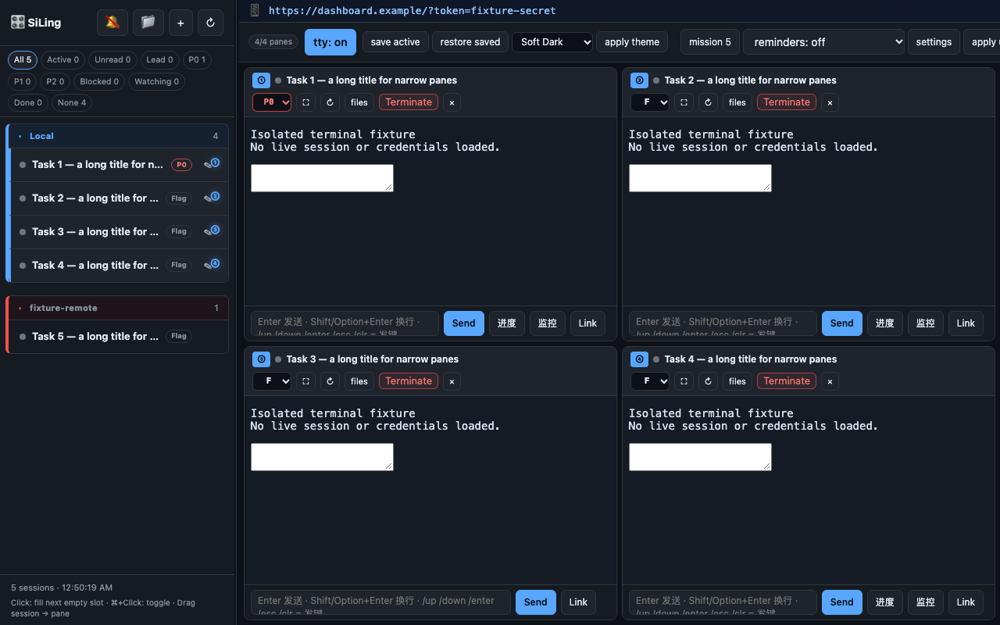
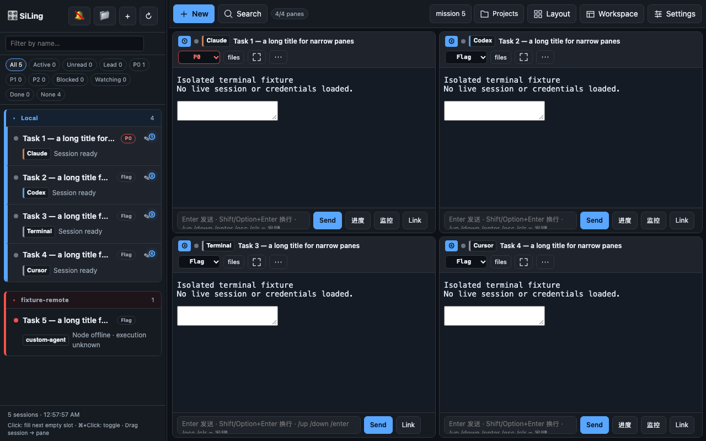
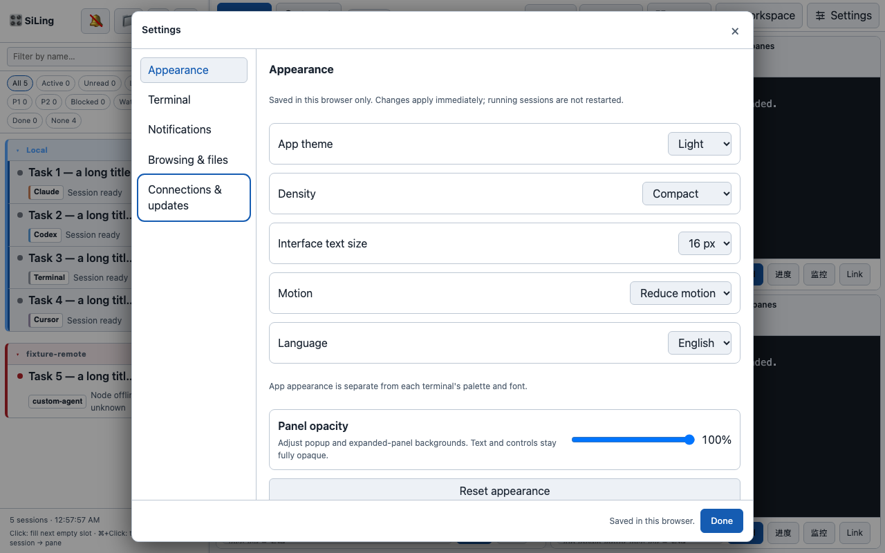
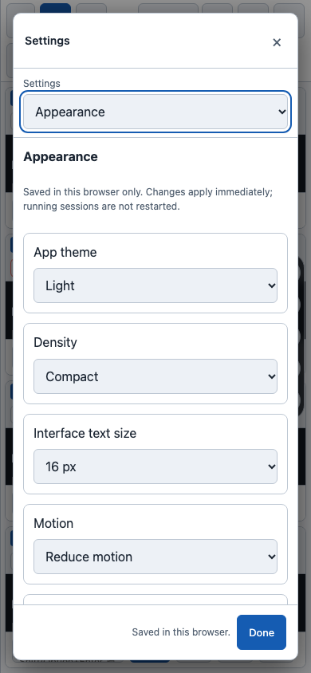

# UI/UX 实施报告

日期：2026-09-28。对应 [目标规格](uiux-improvement-spec.md)。

后续增量：[图标与 Agent 身份视觉精修](uiux-visual-polish.md)已实现，最新完整测试为 239/239 通过；下文保留首批基础改造的范围与历史测试记录。

本批完成阶段 A 的桌面基础改造，**不是全部 spec 完成**。未部署、未重启使用中的 Dashboard；没有修改服务端配置、终端协议、认证策略或 `panel_state` 数据格式。

## 已实现

- **入口整理**：顶栏保留新建、搜索、Mission Control、项目、布局、工作区、设置。十种布局都有缩略图；保存／恢复、排序及关闭所有面板移入工作区。恢复可用的实时会话搜索，支持按名称、Agent、目录等匹配。
- **面板操作**：统一 Agent 文字徽标；常驻标记、文件、放大、更多。重连、配色、移动／交换、关闭与终止集中在可键盘访问的对话框内。明确区分关闭面板与终止会话的后果，展开 B/W/D 为完整文字。
- **外观与设置**：独立的应用深色／浅色／系统主题、紧凑／舒适密度、14–16px 界面字号、减少动画、中英文基础文案。设置分成外观、终端、通知、浏览与文件、连接与更新；窄屏使用分组选择器。原有配色、透明度、内部链接、提醒和更新操作继续可用。
- **范围与安全提示**：偏好只保存在当前浏览器，坏值回退；保存失败显示提示。透明度作用于背景，不降低文字透明度。连接地址默认遮蔽凭据，复制完整登录链接前显示权限提示。
- **状态说明**：解释 Lead、优先级、人工标记共用字段的现状；远程离线明确显示“execution unknown”，不把离线当成完成。
- **创建竞态修复**：旧实现异步返回后直接赋值原槽位，可能覆盖请求期间新放入的会话。现在原槽位仍空闲才使用它，否则选择其他空位；无空位则提示从列表打开。结果先于库存到达时显示启动占位，不把已预约的位置呈现成可再次创建的空位。

## 修改文件

| 文件 | 用途 |
| --- | --- |
| `static/index.html` | 设置分组、顶栏与 pane 菜单、搜索、创建竞态、凭据显示 |
| `static/ui-foundation.js` | 偏好校验／存储、文字徽标、SVG、基础翻译、焦点管理、槽位选择 |
| `static/ui-foundation.css` | 应用主题、密度、响应式设置、菜单和公共视觉规则 |
| `tests/test_ui_foundation.py` | 新增 7 项可执行行为／结构测试 |
| `tests/ui_browser.mjs` | 无 npm 依赖的完整页面浏览器回归，使用隔离的 API／终端样本 |
| `tests/test_dashboard_security.py` | 更新原有 UI 源码契约，不改变后端断言 |
| `README.md`、`README_CN.md`、规格与本报告 | 新入口说明、阶段状态与验证限制 |
| `docs/assets/uiux-*.png` | 脱敏样本的前后截图 |

## 验证证据

- **完整 unittest：235/235 通过**，以 warnings-as-errors 运行。
- Python 编译、逐个 shell 脚本语法、示例 JSON、inline JavaScript、新 JS 模块和浏览器脚本语法、`git diff --check` 均通过。
- Chromium/Edge 完整页面：1280×800、1440×900、768×1024、390×844、320×740。验证顶栏不溢出、菜单不裁切、设置焦点循环／Escape／焦点恢复、实时搜索、保存成功及存储失败、关闭面板不停止会话、异步创建不覆盖槽位。
- 同一浏览器四个终端 iframe 样本：更改外观、移动和放大期间，加载计数维持 **4**，输入草稿保留。随后关闭并重新打开一个测试面板时计数变为 **5**；这不计作意外重连。没有执行内存或延迟基准，不能据此宣称总体性能提升。
- 真实 ttyd + 独立 tmux socket：Terminal 和 Codex 均验证拖选复制、点击后直接输入、历史输入首字符保留、Unicode 粘贴、滚轮回到最新自动退出历史、换行链接两段高亮及完整目标打开。没有向模型提交任务。
- 独立输出目录中通过真实 API 完成 Terminal 后台创建 → ttyd HTML 接入 → 执行命令并读到输出 → 停止。现有 tmux 会话保持运行。此项与页面样本测试分开，不声称覆盖同一条完整生产浏览器链路。

复现自动检查：

```bash
python -W error -m unittest discover -s tests -v
UI_BROWSER=/absolute/path/to/chromium node tests/ui_browser.mjs /tmp/siling-ui-evidence
```

浏览器脚本只操作自行启动的本地样本服务器，不连接使用中的 Dashboard。可用 `UI_BASELINE=1` 对比基线提交 `5de0bdb`；该模式需要本地有该提交。

## 截图

以下均为测试样本，不含真实会话内容或登录凭据。

### 改造前



### 改造后







## 尚未完成与下一步

1. **A 的后续细节**：布局收藏、完整的项目／Agent／状态筛选、全量 SVG 替换、更多旧页面翻译、所有旧弹窗统一焦点管理，以及请求尚未返回时的启动占位／失败内联重试。当前标签不代表这些都已完成。
2. **B**：手机任务列表、单会话输出／文件／信息、仅一个交互终端、按会话保存草稿、辅助按键、键盘视口、Files 树与预览切换。现阶段手机仍使用原有多面板模式。
3. **C**：待处理中心、真正的心跳时效与信号来源、服务端设置读写／目录校验／原子写入、更新诊断的持久化反馈。服务端 working dir 默认保持原配置，本次未增加对应写入 API。
4. 必须补实际 iOS Safari/PWA 与 Android Chrome 测试，包括触摸复制、软键盘、横竖屏、断网与重连；桌面模拟尺寸不能替代真机验收。

## 风险与回滚

- 本批不改变服务端状态格式，风险集中在 CSS 继承、旧弹窗与新原生 `dialog` 的交互、Safari 表现。现有页面并未完成全量对比度／读屏审计；新增控件采用文字、可访问名称及可见焦点。
- 更新入口移入设置，但测试后再批准的原有执行逻辑未更改。是否加载本批代码应由用户决定；未对运行中的 checkout 执行更新或重启。
- 建议下一批先补 A 的键盘／浏览器兼容验收，再单独实施 B 的连接生命周期，避免将手机界面重做与服务端配置写入混在一起。
- 回滚使用本批提交的 `git revert`，不要重置用户会话或清除旧偏好。新增 `siling_appearance_v1` 可留在浏览器中，旧版本不会读取；原有槽位、终端和透明度偏好兼容。
