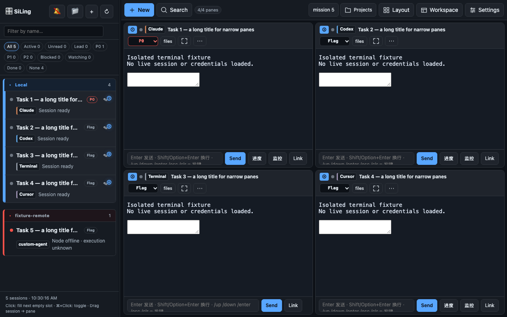
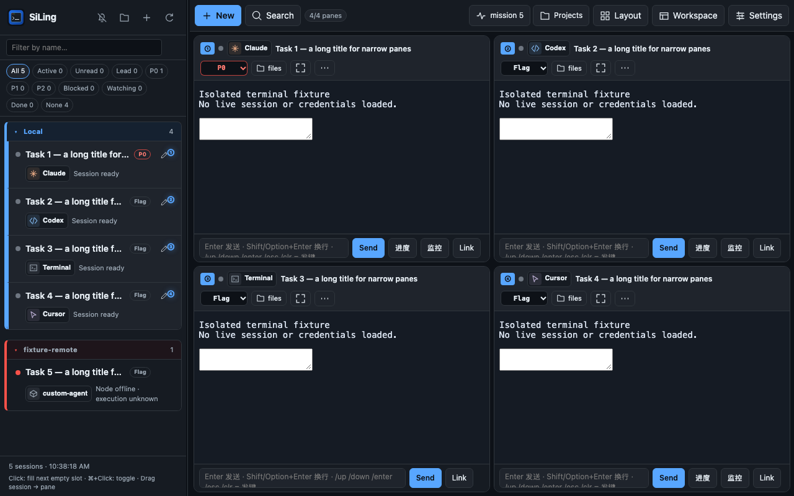
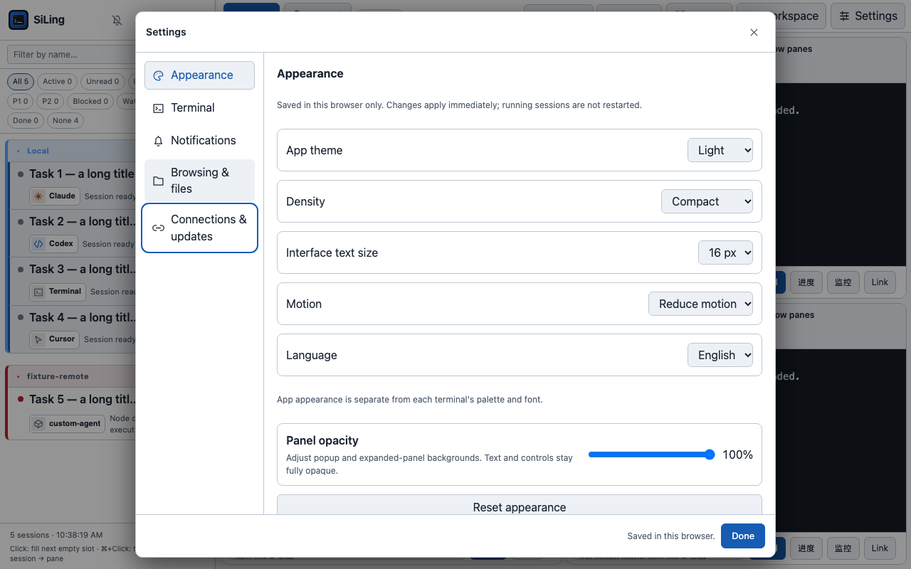
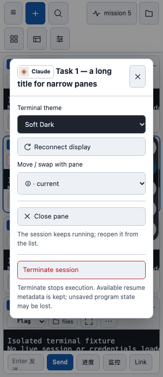

# UI/UX 视觉精修：图标与 Agent 身份

日期：2026-09-28。对应 [规格 VISUAL-01 / AGENT-01](uiux-improvement-spec.md)。这是阶段 A 的第二个增量，不代表全部 UI/UX 规格完成。

## 问题与范围

第一批整理了入口和设置，但常用按钮仍混用 emoji、文字字符与 SVG；Agent 身份只有彩色边线。通知、Mission Control 和 Files 按钮还会在状态更新时直接替换 `textContent`，不能只在初次加载时插入图标。

本批统一这些常用入口的视觉表达，并让动态渲染保留 SVG 与文字。没有修改服务端、终端输入协议、通知触发策略、会话生命周期或更新流程。

## 已实现

- 品牌区复用仓库已有应用图标；通知、整理、新建、刷新、重命名、面板菜单及设置导航采用本地 SVG。没有新增依赖、CDN 或第三方品牌素材。
- Claude、Codex、Cursor、Terminal、未知 Agent 分别使用不同的原创图形与名称。侧栏、面板、新建预览、面板详情和 Mission Control 共用身份组件；形状与文字共同辨识，不只依赖颜色。
- 身份装饰使用暖色、冷色、中性色和灰色；深浅主题分别配色。主按钮及槽位标记在浅色主题下改用白色文字，保留键盘焦点、禁用与减少动画状态。
- 通知开启、关闭、浏览器拒绝权限使用不同图形和可访问名称；开关提供 `aria-pressed`。计数刷新及语言切换不会抹掉按钮图标。
- 未知名称保留原文并转义；`__proto__` 等特殊名称不再误命中字典原型。SVG 从固定路径表选择，不接受外部图形字符串。
- 更新静态资源版本参数，避免旧缓存与新标记混用。

## 修改文件

| 文件 | 内容 |
| --- | --- |
| `static/ui-foundation.js` | SVG、身份徽标、按钮内容与通知状态渲染 |
| `static/ui-foundation.css` | 图标尺寸、徽标配色、按钮状态、品牌及设置导航间距 |
| `static/index.html` | 替换入口并接入动态图标渲染 |
| `tests/test_ui_foundation.py` | 新增 2 项测试，扩展身份回退与转义验证 |
| `tests/test_dashboard_security.py` | 保留关闭／终止分离契约，适配内部文字标签 |
| `tests/ui_browser.mjs` | SVG 点击、动态计数、通知权限、翻译、主题和焦点回归；样本服务器正确返回 SVG MIME |
| `README.md`、`README_CN.md` | 同步图标与身份说明 |
| 本报告、实施报告、`docs/assets/uiux-polish-*.png` | 范围、证据及脱敏截图 |

## 验证

- Python 3.13.5：`python3 -W error -m unittest discover -s tests -v`，**239/239 通过，无跳过**。
- Python 编译、逐文件 shell 语法、示例 JSON、inline JS、新 JS 模块、浏览器脚本语法与 `git diff --check` 通过。
- Edge/Chromium 隔离页面：1280×800、1440×900、768×1024、390×844、320×740。验证动态图标、中英文切换、深浅及系统主题、键盘焦点、菜单点击、禁用样式、保存失败、异步新建、搜索、移动／放大与草稿保留。
- 外观、移动和放大期间四个终端样本 iframe 加载计数保持 4；主动关闭并重开后才变为 5。页面无未捕获异常。
- 自建真实 Terminal 会话完成后台创建 → ttyd 接入 → 发送并读到命令结果 → 停止；既有 tmux 会话保持运行。
- 独立 tmux/ttyd 的 Terminal 与 Codex 回归通过：复制、直接输入、历史输入／粘贴、滚轮返回最新、跨行链接高亮与完整打开。没有向模型提交任务。

浏览器测试使用隔离的样本 API；真实会话生命周期测试另行执行，不能视为完整生产端到端验证。手机尺寸由桌面浏览器模拟，没有完成手机真机验收或性能基准。

## 截图

### 本批之前

### 本批之后

## 风险与下一步

本批仅改展示层，主要风险是旧浏览器 SVG/CSS 渲染差异与窄屏空间。`color-mix` 不支持时有纯色背景回退；Agent 仍保留文字。尚未完成全量读屏／对比度审计、所有旧入口 SVG 替换及全量翻译。

按隔离开发流程验证后推送自有 `main`；**不在本批应用更新或重启运行中的 Dashboard**。用户可先看截图，再通过现有验证／批准更新入口应用。回退应使用本批提交的 `git revert`，不清除会话或浏览器偏好。

建议下一批补手机真实设备验收，并单独实施规格 B 的单会话导航与终端连接管理，不混入本次视觉修改。
